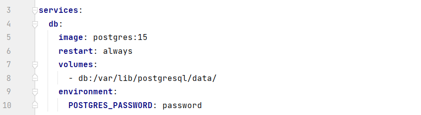

# Задание 1

## Описание
>В сервисе реализован метод, принимающий на вход POST запросы с содержимым вида {"questions_num": int}, количество вопросов. 
После получения запроса, сервис запрашивает вопросы с публичного API, полученные вопросы
сохраняются в базе данных, если полученный вопрос встречался в базе, запрашивается новый вопрос.
Ответом на запрос является предыдущий сохраненный вопрос.
## Стек технологий

>Язык: __Python 3__<br>
Web framework: __Django & DRF__<br>
База данных: __PostgreSQL__<br>

Другое: Docker

## API views

> - <p>/api/v1/requests — POST запрос на добавление вопросов в базу данных;<br>


## Приватная информация

>Скрытая информация в файле .env:<br>
>>PASSWORD=пароль от postgres<br>
SECRET_KEY=django key<br>


## Запуск
1. Склонируйте репозиторий и перейдите в директорию проекта, активируйте виртуальное окружение:
```
git clone https://github.com/anton431/bewise_1.git
```
2. Установите все необходимые зависимости  и заполните файл .env:
```
pip install -r requirements.txt
```
3. Установите пароль от базы данных в docker-compose в переменной POSTGRES_PASSWORD:


4. Выполните команды:
```
docker-compose build
```
```
docker-compose up
```
5. Создайте суперпользователя django и заполните требуемые поля (необязательный пункт):

- Для этого найдите CONTAINER ID образа bewise командой:
```
docker ps -a
```
- Создайте суперпользователя и войдите в <a href=http://localhost:8000/admin>админку</a>:
```
docker exec -it <CONTAINER ID> python manage.py createsuperuser
```
6. В проекте используется PostgreSQL, зайдите в <a target="_blank" href=http://localhost:5051/login>pgAdmin</a> с помощью email и пароля:
```
pgadmin4@pgadmin.org
```
```
root
```

7. Зарегистрируйте сервер: <br>
>

>

> Пароль вашей PosgreSQL

> Цель достигнута

8. Можно выполнять <a target="_blank" href=http://localhost:8000/api/v1/requests>запросы</a>:
>  Запрос через форму drf

> Запрос в требуемой форме
```
{
"questions_num": 1
}
```

>  Пример работы

>  В результате в базу добавятся 10 уникальных вопросов, ответ - предыдущий сохраненный вопрос для викторины.
9. Запуск без docker:
- выполните пункты 1 и 2;
- заполните строчки 95-104 в соответствии с Вашим PostgreSQL;
- выполните следующие команды:
```
python manage.py makemigrations
```
```
python manage.py migrate
```
```
python manage.py runserver
```
```
python manage.py createsuperuser
```
- можно пользоваться <a href=http://127.0.0.1:8000/api/v1/requests target="_blank">сервисом</a>.