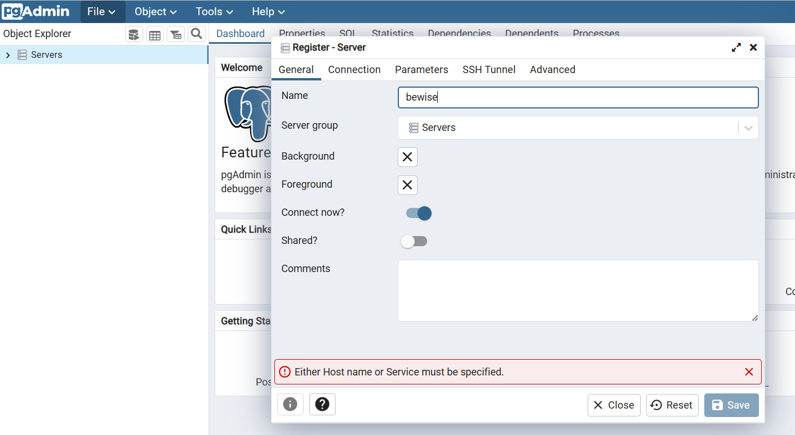
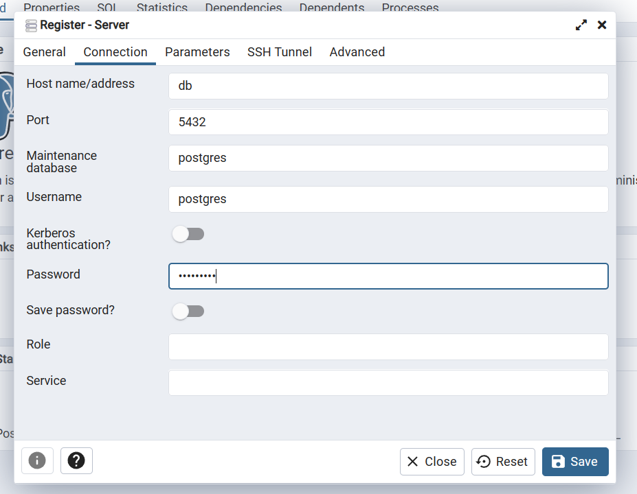
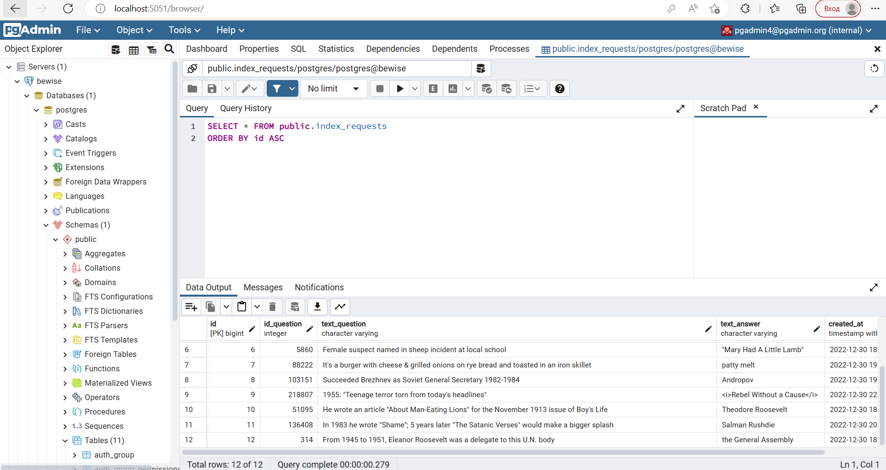
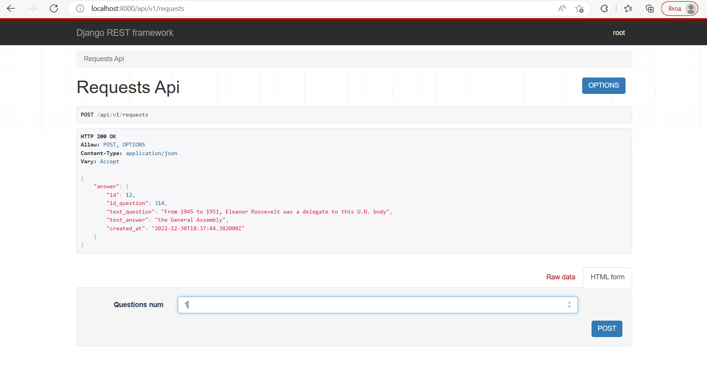
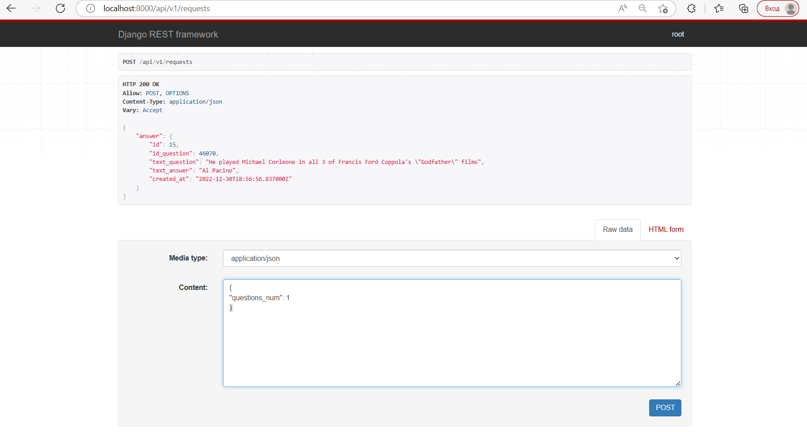
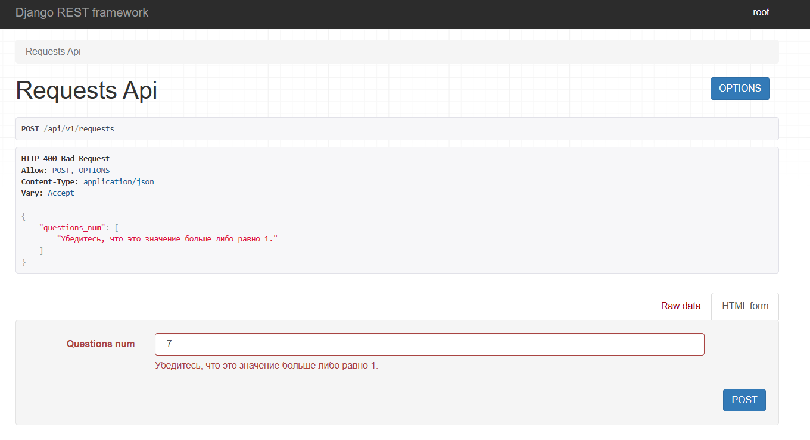
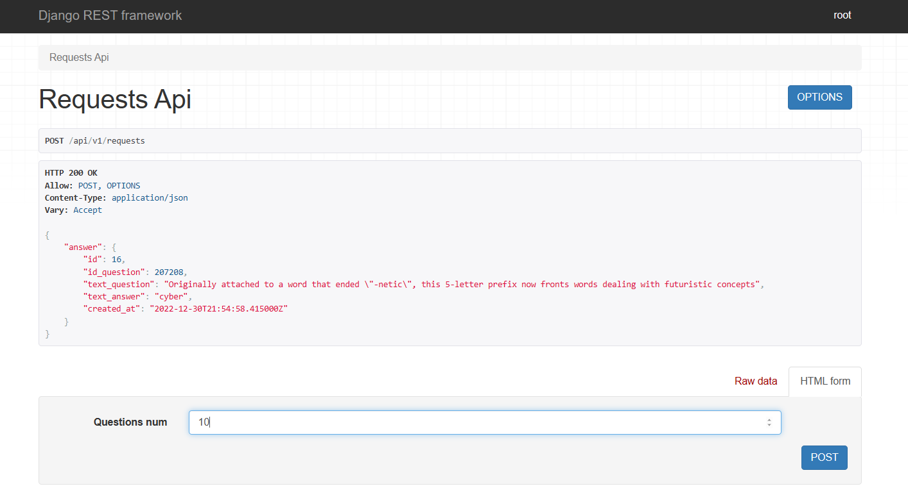

# Задание 1

## Описание
>В сервисе реализован POST метод, принимающий на вход запросы с содержимым вида {"questions_num": int}, количество вопросов. 
После получения запроса, сервис запрашивает вопросы с будличного API, полученные вопросы
сохраняются в базе данных, если полученный вопрос встречался в базе, запрашивается новый вопрос.
Ответ на запрос является предыдущий сохраненный вопрос.
## Стек технологий

>Язык: __Python 3__<br>
Web фремворк: __Django & DRF__<br>
База данных: __PostgreSQL__<br>

Другое: Docker

## API views

> - <p>/api/v1/requests — POST запрос на добавление вопросов в базу данных;<br>


## Приватная информация

>Скрытая информация в файле .env:<br>
>>PASSWORD — пароль от postgres;<br>
SECRET_KEY — django key;<br>


## Запуск
1. Склонируйте репозиторий и перейдите в директорию проекта, активируйте виртуальное окружение
```
git clone https://github.com/anton431/bewise_1.git
```
2. Установите все необходимые зависимости  и заоплните файл .env:
```
pip install -r requirements.txt
```
3. Запустите docker и выполните команды:
```
docker-compose build
```
```
docker-compose up
```
4. Создайте суперпользователя джанго и заполните требуемые поля (необязательный пункт):

- Для этого найдите CONTAINER ID bewise образа командой:
```
docker ps -a
```
- Создайте суперпользователя, войти в админку можно <a target="_blank" href=http://localhost:8000/admin>тут</a>:
```
docker exec -it <CONTAINER ID> python manage.py createsuperuser
```
5. В проекте используется PostgreSQL, зайдите в <a target="_blank" href=http://localhost:5051/login>pgAdmin</a> с помощью email и пароля:
```
pgadmin4@pgadmin.org
```
```
root
```

6. Зарегистрируем сервер: <br>
>

>

> Пароль используйте вашей PosgreSQL

> Цель достигнута

7. Можно делать <a target="_blank" href=http://localhost:8000/api/v1/requests>запросы</a>:
>  Запрос через форму drf

> Запрос в требуемой форме
```
{
"questions_num": 1
}
```

>  Пример работы

>  Еще один пример работы. В базу добавятся 10 уникальных вопросов, получим ответ - последний вопрос, перед добавлением этих.

8. На случай если прийдется запускать без docker:
- выполните пункты 1 и 2;
- расскоментируйте строчки 95-104 в settings, закоментируйте 84-93;
- заполните эти строчки в соответствии с Вашим PostgreSQL;
- выполните команды:
```
python manage.py makemigrations
```
```
python manage.py migrate
```
```
python manage.py runserver
```
```
python manage.py createsuperuser
```
- можно пользоваться <a target="_blank" href=http://127.0.0.1:8000/api/v1/requests>сервисом</a>.